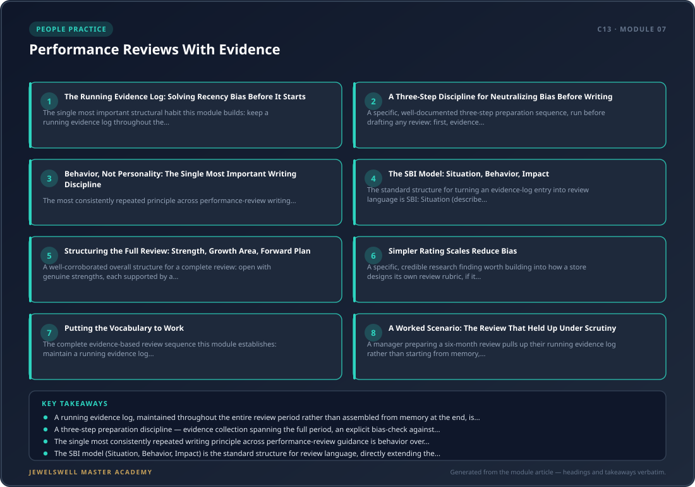

# Performance Reviews With Evidence

## Why This Module Matters

Modules 5 and 6 built the ongoing floor-coaching debriefs and weekly one-on-ones that generate a steady stream of real observations about an associate's performance. This module is where that accumulated evidence gets organized into a formal review — and where a manager who's been coaching well all along can either cash in that discipline for a genuinely fair, well-supported review, or squander it by writing the review from memory in the final week, which is when most of the common review failures actually happen.

<figure>
  
  <figcaption><strong>Figure 7.1:</strong> Performance Reviews With Evidence — module framework at a glance: The Running Evidence Log: Solving Recency Bias Before It Starts · A Three-Step Discipline for Neutralizing Bias Before Writing.</figcaption>
</figure>

## The Running Evidence Log: Solving Recency Bias Before It Starts

The single most important structural habit this module builds: keep a running evidence log throughout the review period, not a document assembled from memory in the final weeks. The specific content to log as it happens: dated, specific examples of strong work, dated examples of misses or development areas, feedback already given formally or informally (which, if Modules 5 and 6 are already running, already exists), progress against goals (what was set, what was achieved, what slipped), and relevant things said by others about the person's work. This directly solves recency bias — the well-documented tendency for a review to overweight whatever happened in the last few weeks, simply because that's what a manager remembers most vividly, while a genuinely strong first four months of the review period fades from memory by the time the review gets written.

## A Three-Step Discipline for Neutralizing Bias Before Writing

A specific, well-documented three-step preparation sequence, run before drafting any review: first, evidence collection — pull specific, dated examples from one-on-one notes, coaching debriefs, and any cross-functional feedback spanning the entire review period, not just the last six weeks. Second, a bias-check — explicitly audit the draft against recency bias, halo bias (letting one strong trait color every rating), and leniency bias (rating everyone favorably to avoid an uncomfortable conversation), asking directly whether the same rating would result if the last month had gone differently. Third, outcome framing — translate every observation into a consistent structure: what the person did, in what specific context, and what effect it had, so the review reads as a record of actual work rather than a verdict on the person's character.

## Behavior, Not Personality: The Single Most Important Writing Discipline

The most consistently repeated principle across performance-review writing guidance, appearing independently across nearly every source consulted for this module: describe the specific behavior and its impact, never the personality trait. "You missed two client deadlines this quarter" is something an associate can actually act on; "you're disorganized" is a label that tells them nothing about what to change. This distinction matters especially for exactly the kind of subjective judgment retail coaching often drifts into — "not a team player" or "bad attitude" are personality labels that generate defensiveness and offer no path forward, while "twice this quarter, you left the sales floor understaffed during the lunch rush without notifying anyone" is a specific, actionable, defensible observation.

## The SBI Model: Situation, Behavior, Impact

The standard structure for turning an evidence-log entry into review language is SBI: Situation (describe specifically when and where the behavior occurred, specific enough that the associate can actually recall the moment), Behavior (state exactly what the person did or said, with no interpretation or judgment folded in), and Impact (explain what effect that behavior actually had, on a customer, a colleague, or a result). This is the same core discipline Module 5 already built for floor debriefs (observation-impact-alternative) and Module 6 built for one-on-one feedback, now applied to the more formal, written performance-review context — a genuinely direct continuity across three modules of this course.

## Structuring the Full Review: Strength, Growth Area, Forward Plan

A well-corroborated overall structure for a complete review: open with genuine strengths, each supported by a specific, dated example from the actual review period (not a generic compliment); name one or two growth areas, each following the SBI structure and explicitly tied to a specific skill or habit rather than a personality trait; and close every review with a specific forward plan and a commitment to follow up, so both people can actually track progress afterward rather than the review functioning as a closed, final verdict. Most sources converge on keeping this focused — two to four strengths and one or two growth areas, each anchored to a real example, rather than an exhaustive list that dilutes the associate's ability to act on any single piece of feedback.

## Simpler Rating Scales Reduce Bias

A specific, credible research finding worth building into how a store designs its own review rubric, if it uses numeric ratings at all: research published in Nature found that switching from a finer-grained five-star rating scale to a simpler scale measurably reduced racial bias in performance ratings in an online-marketplace context. While this specific study's context (online marketplace ratings) is not identical to an in-store performance review, the underlying mechanism — that finer rating granularity gives more room for unconscious bias to operate, while a simpler scale constrains that room — is a reasonable, evidence-informed argument for keeping any numeric rating scale a store uses simple rather than needlessly granular.

## Putting the Vocabulary to Work

The complete evidence-based review sequence this module establishes: maintain a running evidence log throughout the review period, fed directly by Module 5's coaching debriefs and Module 6's one-on-one notes; before writing, run the three-step bias-neutralizing discipline (evidence collection spanning the full period, an explicit bias-check, and outcome framing); write every strength and growth area using the SBI structure, focused on behavior rather than personality; keep the full review to two-to-four strengths and one-to-two growth areas, each anchored to a real, dated example; and close with a specific forward plan and a committed follow-up point.

## A Worked Scenario: The Review That Held Up Under Scrutiny

A manager preparing a six-month review pulls up their running evidence log rather than starting from memory, and finds it contains eleven dated entries spanning the full period — several strong client-interaction observations from month two, a coaching note from month four about a specific objection-handling gap that was later resolved, and two recent entries from the final month. Running the bias-check explicitly, the manager notices the draft was starting to lean heavily on the two most recent entries and deliberately re-weights the review to reflect the full six months, including the genuinely strong month-two performance that had started to fade from memory. When the associate later asks a specific question about one of the growth areas, the manager can point to the exact dated log entry and the specific behavior and impact recorded at the time — a level of specificity a memory-based review could never have produced.

## Practice Exercise

Start a running evidence log today for one associate, structured with columns for date, specific behavior observed, context, and impact. Pull the last three weeks of any existing coaching debrief notes (Module 5) or one-on-one notes (Module 6) and backfill the log with whatever specific, dated entries already exist. Commit to adding at least one entry per week going forward, so that whenever this associate's next formal review comes due, it can be written from evidence spanning the full period rather than assembled from memory in the final week.

## Key Takeaways

- A running evidence log, maintained throughout the entire review period rather than assembled from memory at the end, is the single most important structural habit for solving recency bias, and should be fed directly by the coaching debriefs (Module 5) and one-on-one notes (Module 6) this course has already established.
- A three-step preparation discipline — evidence collection spanning the full period, an explicit bias-check against recency/halo/leniency bias, and outcome framing — should run before drafting any review, not after.
- The single most consistently repeated writing principle across performance-review guidance is behavior over personality: describe the specific action and its impact, never a character trait or label, since a behavior gives an associate something they can actually act on.
- The SBI model (Situation, Behavior, Impact) is the standard structure for review language, directly extending the observation-impact-alternative structure Module 5 built for floor debriefs and the feedback structure Module 6 built for one-on-ones into the more formal written-review context.
- A complete review stays focused (two to four strengths, one to two growth areas, each anchored to a specific dated example) and closes with a forward plan and a committed follow-up point, and a simpler rating scale, if numeric ratings are used at all, is a reasonable, evidence-informed way to reduce the room for unconscious bias to operate.
