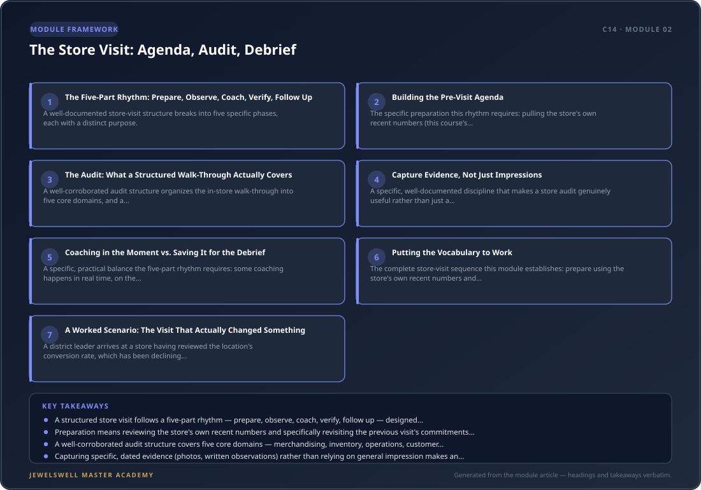

# The Store Visit: Agenda, Audit, Debrief

## Why This Module Matters

Module 1 established the core mindset shift for multi-unit leadership: coach, don't fix. This module builds the specific, structured practice where that principle actually gets applied — the store visit itself. A store visit without a deliberate structure tends to drift into exactly the pattern Module 1 warned against: a district leader walks in, spots a problem, and fixes it personally, then leaves having accomplished nothing that outlasts their departure. A structured visit does the opposite: it observes, coaches, and verifies in a specific sequence designed to build the store manager's own capability rather than substitute for it.

<figure>
  
  <figcaption><strong>Figure 2.1:</strong> The Store Visit: Agenda, Audit, Debrief — module framework at a glance: The Five-Part Rhythm: Prepare, Observe, Coach, Verify, Follow Up · Building the Pre-Visit Agenda.</figcaption>
</figure>

## The Five-Part Rhythm: Prepare, Observe, Coach, Verify, Follow Up

A well-documented store-visit structure breaks into five specific phases, each with a distinct purpose. Prepare happens before ever walking into the store: review sales, conversion, payroll, staffing, and other key business results in advance, and specifically revisit the commitments and action items from the previous visit before setting foot on the floor. Observe means watching the store through the customer's eyes before saying anything — assessing customer engagement, selling behaviors, leadership presence, and store standards as a genuine first-time visitor would experience them, not immediately jumping to comparing against a checklist. Coach means engaging the store manager directly, asking questions before offering solutions, and coaching on what's actually observed in real time rather than saving every observation for a formal end-of-visit conversation. Verify means checking that prior commitments were actually followed through on, not just discussed. And follow up means documenting who owns each action, the specific timing, and how the district leader will check back — the same accountability discipline Module 1 identified as where the real leadership work happens.

## Building the Pre-Visit Agenda

The specific preparation this rhythm requires: pulling the store's own recent numbers (this course's companion content in C12 on KPIs and C11 on operating rhythm gives a district leader the exact vocabulary to know what to pull) and reviewing what was committed to at the end of the last visit. A visit that starts cold, with no reference to what was promised last time, immediately signals to the store manager that those commitments weren't actually being tracked — exactly the accountability failure Module 1 warned would undermine the whole multi-unit structure.

## The Audit: What a Structured Walk-Through Actually Covers

A well-corroborated audit structure organizes the in-store walk-through into five core domains, and a district leader benefits from following the same consistent structure at every store specifically so results are comparable across the district (a theme Module 3 of this course will build on directly). Merchandising and visual standards cover planogram compliance, signage accuracy, and whether displays match brand standards. Inventory and stock management cover accuracy against system records, stock rotation, and whether replenishment is timely. Store operations cover cleanliness, safety, opening/closing procedure adherence, and cash-handling compliance. Customer experience covers greeting speed, staff product knowledge, and service-level responsiveness. And compliance and loss-prevention cover the specific security and regulatory disciplines this project's own C4 and C11 content already establishes at the single-store level, now checked for consistency across every location a district leader oversees.

## Capture Evidence, Not Just Impressions

A specific, well-documented discipline that makes a store audit genuinely useful rather than just a subjective impression: record photos, specific observations, and relevant context for every finding, and compare the expected standard against what's actually happening rather than relying on memory. This directly mirrors the evidence-based discipline this course's own C13 content already established for performance documentation — specific, dated, observable evidence, not a vague overall impression, is what makes a finding both fair and actionable.

## Coaching in the Moment vs. Saving It for the Debrief

A specific, practical balance the five-part rhythm requires: some coaching happens in real time, on the floor, when something is actually observed — "ask questions before providing solutions" and "coach the Store Manager on what you observe in real time" are both explicit parts of the recommended rhythm. But the formal debrief at the end of the visit is where the pattern across the whole visit gets synthesized: recognizing genuinely strong performance specifically enough to reinforce it, and agreeing on two or three clear priorities before leaving — deliberately not an exhaustive list of every issue found, since Module 5's coaching-focus discipline (one development area, not five) applies just as directly to a store-visit debrief as it does to an individual coaching conversation.

## Putting the Vocabulary to Work

The complete store-visit sequence this module establishes: prepare using the store's own recent numbers and last visit's commitments; observe the store as a customer would before consulting any checklist; walk the structured audit across the five core domains, capturing photo and written evidence rather than relying on impression; coach in the moment when something specific is observed, asking questions before offering solutions; debrief formally at the end with genuine recognition and two or three focused priorities; and follow up with named owners, specific timing, and a clear plan for verifying at the next visit.

## A Worked Scenario: The Visit That Actually Changed Something

A district leader arrives at a store having reviewed the location's conversion rate, which has been declining for three weeks, and the specific commitment from the last visit (improving peak-hour staffing coverage) that was never followed up on. Walking the floor as a customer would before saying anything, the district leader notices the same peak-hour coverage gap that caused the original commitment. Rather than immediately correcting the schedule personally, the district leader asks the store manager what they're seeing in the conversion data and what's actually preventing the staffing fix from happening. The store manager reveals a specific, previously unmentioned scheduling-software constraint that's been blocking the fix. The debrief ends with one focused priority — resolving the scheduling constraint within one week — with a specific named owner and a documented follow-up date. Because this visit surfaced the real underlying obstacle rather than re-issuing the same generic instruction, the fix actually happens before the next visit, rather than becoming a third consecutive unaddressed commitment.

## Practice Exercise

Before your next store visit, pull the store's recent KPI trend and the specific commitments from the last visit. During the visit, deliberately observe the floor as a customer would for the first several minutes before consulting any checklist. Run the audit using the five core domains, capturing at least one piece of specific, dated evidence (a photo or written observation) for any finding. At the debrief, limit yourself to exactly two or three priorities, each with a named owner, a specific timing, and a plan for how you'll verify it at the next visit.

## Key Takeaways

- A structured store visit follows a five-part rhythm — prepare, observe, coach, verify, follow up — designed specifically to build the store manager's own capability rather than substitute for it, directly applying Module 1's "coach, don't fix" principle in practice.
- Preparation means reviewing the store's own recent numbers and specifically revisiting the previous visit's commitments before arriving, since starting cold signals that those commitments weren't actually being tracked.
- A well-corroborated audit structure covers five core domains — merchandising, inventory, operations, customer experience, and compliance/loss-prevention — applied consistently across every store specifically so results are comparable district-wide.
- Capturing specific, dated evidence (photos, written observations) rather than relying on general impression makes an audit finding both fair and actionable, directly mirroring the evidence-based documentation discipline this course's own C13 content already established.
- The formal debrief should stay focused on exactly two or three priorities with named owners and specific timing, rather than an exhaustive list of every issue found, since a store manager walking away with too many priorities rarely makes real progress on any of them.
