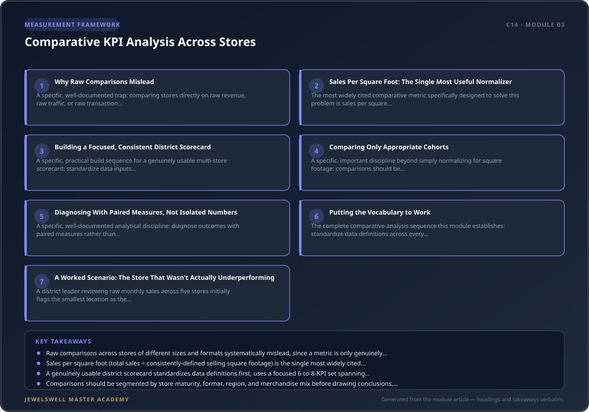

# Comparative KPI Analysis Across Stores

## Why This Module Matters

Module 2 established the store-visit structure that generates comparable, consistent observations across every location a district leader oversees. This module covers the parallel discipline for the numbers: comparing stores fairly, on metrics genuinely normalized for size, format, and context, rather than making the single most common comparison mistake in multi-unit retail — ranking a 1,200-square-foot boutique against a 4,000-square-foot flagship on raw sales and concluding the smaller store is simply underperforming.

<figure>
  
  <figcaption><strong>Figure 3.1:</strong> Comparative KPI Analysis Across Stores — module framework at a glance: Why Raw Comparisons Mislead · Sales Per Square Foot: The Single Most Useful Normalizer · Building a Focused, Consistent District Scorecard.</figcaption>
</figure>

## Why Raw Comparisons Mislead

A specific, well-documented trap: comparing stores directly on raw revenue, raw traffic, or raw transaction counts systematically misleads, because these numbers are driven as much by a store's physical size, format, and local market as by how well it's actually being run. A compact urban shop and a suburban big-box location use space differently, and placing them in the same raw-number ranking hides useful differences rather than revealing them. The specific discipline that fixes this: a metric is only genuinely comparable across stores when its numerator, denominator, scope, period, and exclusions all remain consistent — comparing two stores where one measures only the selling floor and another includes its stockroom in "square footage" isn't a real comparison at all, however similar the resulting numbers might look.

## Sales Per Square Foot: The Single Most Useful Normalizer

The most widely cited comparative metric specifically designed to solve this problem is sales per square foot: total sales divided by selling square footage, normalizing for store size so a compact urban store and a large suburban location can be compared meaningfully on the same footing. The specific discipline that keeps this metric honest: define selling-floor area once, consistently, and exclude stockrooms, offices, and other non-selling areas the same way at every location — a common trap this module explicitly warns against is comparing stores where one measures carpet area and another measures gross leasable area, which silently breaks the comparison. Reported benchmark ranges vary considerably by retail format and category (general retail sources cite roughly $200-1,200 per square foot annually depending on category), which is itself a further argument for comparing a jewelry store's stores primarily against each other and against jewelry-specific benchmarks, rather than against a generic cross-category figure.

## Building a Focused, Consistent District Scorecard

A specific, practical build sequence for a genuinely usable multi-store scorecard: standardize data inputs first, so "revenue" and "labor hours" mean exactly the same thing at every location — a step described as obvious but rarely actually done in practice. Build a location scorecard using roughly six to eight KPIs per location, deliberately covering at least one metric from each of several categories (revenue, labor, customer experience, operations) rather than an exhaustive list, since more metrics create noise rather than clarity — directly echoing the same 5-8 headline KPI discipline this project's own C12 course already established for a single store's dashboard. Establish internal benchmarks first, using the district's own best-performing location as the initial target for every other location, before layering in external, industry-wide benchmarks. And create a genuine review cadence — weekly location check-ins, monthly portfolio reviews, quarterly executive sessions — since KPIs without a meeting cadence are just reports nobody actually reads.

## Comparing Only Appropriate Cohorts

A specific, important discipline beyond simply normalizing for square footage: comparisons should be segmented by store maturity, format, region, operating hours, and merchandise mix before drawing conclusions. A newly opened store can still be analyzed, but it belongs in its own ramp-up cohort rather than being directly compared against a mature, fully-established location — the same principle this project's own C13 course already established for a new hire's partial ramp-quota expectations, now applied to a store's own performance trajectory after opening. Comparing a mature flagship against a store six months into its first year, without accounting for that maturity gap, produces exactly the same kind of misleading conclusion that comparing stores of different sizes without normalizing for square footage does.

## Diagnosing With Paired Measures, Not Isolated Numbers

A specific, well-documented analytical discipline: diagnose outcomes with paired measures rather than isolated numbers, in the same spirit as this project's own C12 course's driver-tree diagnostic approach to a sales miss. A store with strong sales per square foot but weak customer-experience scores tells a genuinely different story than a store strong on both, or weak on both, and reading any single metric in isolation — including sales per square foot itself — risks missing exactly the kind of pattern a paired reading reveals.

## Putting the Vocabulary to Work

The complete comparative-analysis sequence this module establishes: standardize data definitions across every location before attempting any comparison; build a focused, 6-to-8-KPI scorecard covering revenue, labor, customer experience, and operations categories; use sales per square foot (with a single, consistently applied definition of selling area) as the primary size-normalizing metric; segment comparisons by maturity, format, and region rather than comparing every store against every other store indiscriminately; benchmark first against the district's own best performer, then against external industry figures; and read metrics in pairs, connecting this module's KPI comparison directly to the driver-tree diagnostic discipline this project's own C12 course already established for a single store's sales miss.

## A Worked Scenario: The Store That Wasn't Actually Underperforming

A district leader reviewing raw monthly sales across five stores initially flags the smallest location as the district's weakest performer, since its total revenue trails every other store by a wide margin. Recalculating using sales per square foot — with a consistently applied selling-area definition across all five locations — reveals the smallest store is actually the second-highest performer in the district on a per-square-foot basis; its raw revenue simply reflects a genuinely smaller footprint, not weaker execution. The district leader's attention shifts instead to a mid-sized store that looked adequate on raw revenue but ranks last district-wide on the normalized metric — a genuine underperformance the raw-number comparison had been masking the entire time.

## Practice Exercise

Pull your district's current store-level revenue figures and selling-square-footage data, confirming a single, consistent definition of "selling area" is being applied at every location. Calculate sales per square foot for each store and compare the resulting ranking against a simple raw-revenue ranking. Identify any store whose position changes meaningfully between the two rankings, and investigate what that shift actually reveals about each location's real performance.

## Key Takeaways

- Raw comparisons across stores of different sizes and formats systematically mislead, since a metric is only genuinely comparable when its numerator, denominator, scope, period, and exclusions remain consistent across every location being compared.
- Sales per square foot (total sales ÷ consistently-defined selling square footage) is the single most widely cited normalizing metric for comparing stores of different sizes fairly, though its exact definition of "selling area" must be applied identically everywhere to keep the comparison honest.
- A genuinely usable district scorecard standardizes data definitions first, uses a focused 6-to-8-KPI set spanning revenue, labor, customer experience, and operations, benchmarks first against the district's own best performer, and runs on a genuine, regular review cadence.
- Comparisons should be segmented by store maturity, format, region, and merchandise mix before drawing conclusions, since a newly opened store belongs in its own ramp-up cohort rather than being directly compared against an established, mature location.
- Reading metrics in pairs, rather than any single number in isolation, reveals patterns a single metric alone can hide — directly extending this project's own C12 course's driver-tree diagnostic discipline from a single store's sales miss to comparative analysis across an entire district.
