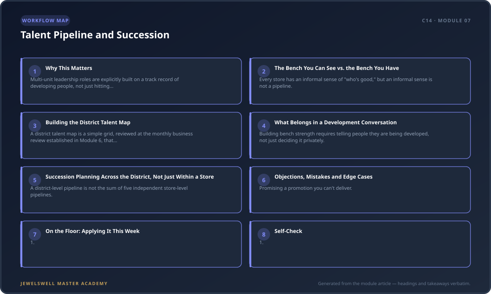

# Talent Pipeline and Succession

When Priya's best store manager resigned with two weeks' notice, Priya spent six weeks running that store herself on top of her other four, because no one on that team had been positioned as a next-in-line. She had a strong assistant manager there, but nobody had ever told that assistant manager she was being developed for the role, so when the moment came, she wasn't ready and didn't know she was supposed to be.

This is the gap between managing performance and building a pipeline. Module 4 taught you to coach the managers you have. This module is about making sure you always have a next one ready — not by accident, but by design.

## Why This Matters

Multi-unit leadership roles are explicitly built on a track record of developing people, not just hitting numbers. A Signet-style district manager posting requires "three to five years of multi-unit management experience" alongside "proven success and expertise in sales, P&L analysis, and merchandising" and a "recruitment and staff-development track record" — development is named as a qualifying credential for the job itself, not a nice-to-have. At store level, this expectation already exists in writing: an assistant store manager posting lists being "responsible for the selection and development of talent to drive store growth," and a sales manager role calls for "hiring quality talent to plan for and create talent bench." Your job as district leader is to make sure that expectation is actually happening at every store, not just written into every job description.

<figure>
  
  <figcaption><strong>Figure 7.1:</strong> Talent Pipeline and Succession — module framework at a glance: Why This Matters · The Bench You Can See vs. the Bench You Have · Building the District Talent Map.</figcaption>
</figure>

## The Bench You Can See vs. the Bench You Have

Every store has an informal sense of "who's good," but an informal sense is not a pipeline. A pipeline requires three things a hallway conversation never produces: a named list of who is ready now, who is ready in twelve months, and who needs a specific skill gap closed before they're ready for anything. Without that list, the store manager resignation Priya faced turns a one-person problem into a five-week crisis, because nobody had done the naming in advance.

**District Leader:** "If your store manager left tomorrow, who on your team could step up, even temporarily?"
**Store Manager:** "Probably my assistant manager, she's sharp."
**District Leader:** "Has she been told that? Does she know what she'd still need to learn before she's ready for the full role?"
**Store Manager:** "...No. I've just been assuming she knows I think highly of her."

Assumed development is not development. The fix is a documented bench, reviewed on the same cadence as everything else in this course.

## Building the District Talent Map

A district talent map is a simple grid, reviewed at the monthly business review established in Module 6, that names every associate identified as a future manager and every assistant manager identified as a future store manager, across every store in the district.

| Store | Current role | Identified successor | Readiness | Gap to close | Next step |
|---|---|---|---|---|---|
| Store A | Store Manager | Assistant Manager (Jordan) | Ready in 6-12 months | P&L analysis, hiring interviews | Shadow next quarterly hiring round |
| Store B | Store Manager | No internal candidate identified | N/A | N/A | Flag as external-hire risk to district leader |
| Store C | Assistant Manager | Senior Associate (Dana) | Ready in 12+ months | Coaching skills, scheduling | Assign a coaching-observation project this quarter |

The single most valuable column on this grid is "Store B" — the store with no identified successor. That is not a coincidence to note and move past; it is the highest-priority item on your next visit to that store, because it means a single resignation there becomes an external, unplanned hire under time pressure.

## What Belongs in a Development Conversation

Building bench strength requires telling people they are being developed, not just deciding it privately. This mirrors the individual-manager-level guidance on building bench strength for one's own promotion, applied here one level up: the district leader's job is to make sure every store manager is having this same conversation with their own high-potential associates.

**Store Manager (to a high-potential associate):** "I want to be straight with you — I see you as a future assistant manager, maybe sooner than you think. To get there, I'd want you to start sitting in on our hiring interviews and taking the lead on one cycle count each month. Is that something you want?"

A development conversation that never happens because a manager assumes it's "obvious" leaves the associate unprepared and, often, unaware they were ever in the running — exactly what happened to Priya's assistant manager.

## Succession Planning Across the District, Not Just Within a Store

A district-level pipeline is not the sum of five independent store-level pipelines. Part of your value as district leader is moving talent across stores when the right opportunity doesn't exist where the right person happens to work — an assistant manager ready for promotion in a store with no open store manager role should be considered for an opening two stores over, rather than left to wait indefinitely or leave for a competitor. This requires you to actually know the talent map across all your stores well enough to make that connection, which is the entire reason the district talent map exists as a single document rather than five separate ones.

## Objections, Mistakes and Edge Cases

**Promising a promotion you can't deliver.** "Ready in 6-12 months" is an assessment, not a guarantee — be clear with associates that development conversations describe a path, not a contract, especially since store openings depend on factors outside any one manager's control.

**Only tracking the obvious high performers.** The best salesperson is not automatically the best future manager; management and coaching ability are different skills from selling ability. Evaluate readiness against management competencies (as covered in Module 4), not just sales numbers.

**Treating "no successor identified" as a private embarrassment for the store manager.** A store with no bench is a district risk, not a personal failing to hide — frame it as a shared problem to solve at the next monthly business review, not a performance mark against the manager.

**Building the pipeline once and never updating it.** People's readiness changes, priorities change, and associates leave. A talent map reviewed once a year is stale by month three; review it at every monthly business review alongside the other people-results content established in Module 6.

## On the Floor: Applying It This Week

1. Build a one-page district talent map covering every store, with the same five columns used above.
2. Identify every store with no named successor and flag it as your highest-priority store visit this month.
3. Ask every store manager whether their identified successor actually knows they're being developed — not whether the manager thinks highly of them.
4. Add the talent map as a standing agenda item in your monthly business review, reviewed with the same discipline as sales results.
5. For any associate ready for promotion with no open role at their own store, check whether an opening exists elsewhere in the district before it goes external.

## Self-Check

1. What three pieces of information does a district talent map need beyond just a name?
2. Why is "no successor identified" the most important finding on a talent map, not the least?
3. What is the difference between assuming someone knows they're being developed and actually telling them?
4. Why should management competency, not sales performance, be the basis for identifying a future manager?
5. Why does succession planning need to happen at the district level rather than within each store alone?
6. What written credential requirement links staff development directly to a district leader's own qualification for the role?

## Go Deeper

- **NHPA Hiring Toolkit** — sourcing and interview structure resources applicable to building the pipeline identified on your talent map.
- **OpenLearn Managing and Managing People** — foundational content on the people-management skills a future manager needs before promotion.
- **Alison Performance Management Review and Analysis** — relevant to assessing readiness objectively rather than on gut feel alone.

**Media credits:** No third-party media has been sourced or verified for this draft. Placeholders below flag what a media researcher should source before publication.

[MEDIA REQUEST: sample district talent map / succession grid template, Tier 1/2 source such as Retail Ops Toolkit or NHPA]
[MEDIA REQUEST: short video on structuring a development conversation with a high-potential employee, Tier 4 credentialed source]
