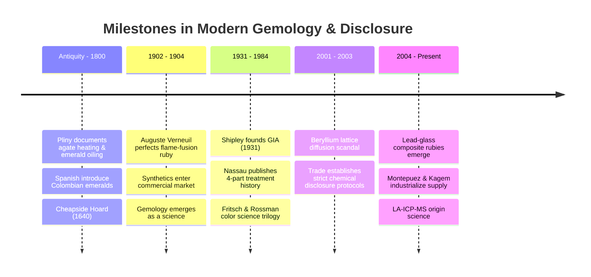
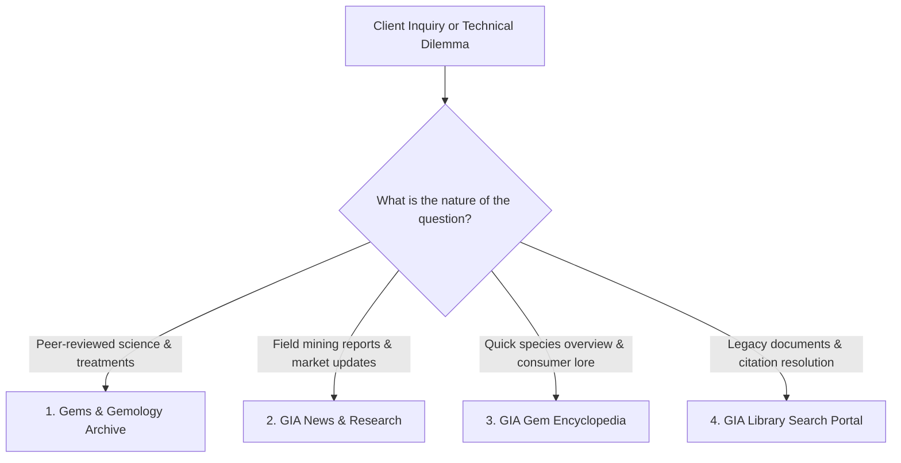

# Before the Grader: A Short History of Colored Stones and How to Use GIA's Library

> **[MEDIA: video | C17-M01-V1]**  
> **Watch:** *A Gemstone's Journey through the GIA Laboratory* — GIA Knowledge Sessions (Presenter: Nicole Ahline GG, FGA; Host: Nathan Renfro GG, FGA)  
> **Why here:** Before mastering grading nomenclature, watch how an unmounted colored stone travels through sample preparation, spectroscopic analysis, refractive index verification, and origin determination. Pay particular attention to the specialized testing required for origin opinions and heat vs. unheated certification.  
> **Source:** https://www.youtube.com/watch?v=P5J1a3_JcTM  
> **Use:** Embed via Tutor LMS Video Player

The remainder of this module establishes the foundation beneath that video: the physics of color, the history of treatment disclosure, and the research tools you need at the counter when high-value heirlooms and unheated gems sit before you.

---

## The Ring That Isn't What Grandma Called It

A client places a vintage yellow-gold ring on your counter pad. It holds an oval blue stone weighing approximately three carats, flanked by single-cut shoulder diamonds. 

*"The family always called it a sapphire,"* she explains. *"My grandmother wore it every Sunday. But it doesn't look like the royal-blue stones in your display, and I want to know what it is, what it's worth, and whether it's been treated."*

She expects an answer before she finishes her coffee.

If your training stops at diamond grading and a basic gemstone overview, you are in a trap. A 10× loupe alone will not tell you whether that blue oval is:
* An unheated Ceylon sapphire with silk intact;
* An iron-rich Australian or Nigerian basaltic sapphire;
* A modern beryllium lattice-diffused stone;
* A flame-fusion synthetic corundum produced in the 1930s;
* A cobalt-colored spinel passed down through generations;
* A natural iolite or violet-leaning tanzanite;
* Or a classic lead-glass composite assembled to deceive.

Rushing to pronounce an identification or value at the counter is the fastest way to destroy professional credibility. Top-producing gemologist-sellers don't guess. They use moments like this to educate the patron on the nuance of fine gems, share what can be observed immediately, and articulate why definitive testing in an accredited gemological laboratory protects their family asset.

This course exists to make you fluent in that conversation. Where introductory training provides a reference chart of Mohs hardness and routine care, **C17 takes you beneath the surface.** You will master the physics of color transmission, geological formation environments, microscopic inclusion scenes, advanced treatment detection, and the origin narratives that govern the market's most coveted stones.

---

## Why Colored Stones Are Not "Fancy Diamonds": The Four Structural Differences

Diamond sales are governed by standardized uniformity. Since Robert M. Shipley and Richard T. Liddicoat codified the 4Cs at GIA in the 1940s and 1950s, diamonds have shared a singular, universal framework: one mineral species (pure carbon), a linear D-to-Z color scale, eleven clarity grades at 10× magnification, and standardized proportion metrics. A 1.50 ct G/VS1 Excellent cut round brilliant reads consistently across Zurich, Tokyo, and New York.

Colored gemstones operate on an entirely different commercial and scientific plane. Four structural realities separate them:

### 1. Species Diversity vs. Monomineralic Uniformity
Diamonds represent a single mineral species. The colored stone trade encompasses **dozens of distinct mineral families and crystalline systems**—corundum, beryl, chrysoberyl, spinel, tourmaline, garnet, zoisite, topaz, spodumene, peridot, and quartz—alongside organic gems such as pearls, amber, and coral. 

Each species possesses unique refractive indices, specific gravities, cleavage planes, and chemical vulnerabilities. There is no single universal grading report that applies equally to an emerald and an opal.

### 2. Color Is the Prime Driver, Not a Demerit
In D-to-Z diamonds, the presence of body color is penalized as an impurity; the ideal is the absence of color. In colored gems, **color is the entire purpose.**

Color is evaluated not by letter grades, but through three interrelated optical dimensions:
* **Hue:** The stone's primary spectral color and any modifying tints (e.g., *slightly purplish Red*).
* **Tone:** The lightness or darkness of the color, graded from 2 (very light) to 8 (very dark), with the sweet spot typically resting between 5 (medium) and 6 (medium-dark).
* **Saturation:** The purity, vividness, or intensity of the hue, ranging from dull/brownish (1–2) to vivid (5–6).

A Burmese ruby is prized because chromium produces an intensely saturated, vivid red with minimal iron to suppress its natural red fluorescence. A Kashmir sapphire commands reverence for its velvety, sleep-softened blue born of microscopic rutile dust. The vocabulary is descriptive, sensory, and species-specific.

### 3. Treatments Are the Industry Standard, Not Anomalies
In diamonds, fracture filling or HPHT color enhancement is rare and heavily discounted. In colored stones, **enhancements are the historical norm.**

* **Over 95% of commercial rubies and sapphires** are thermally enhanced (heat-treated) to alter oxidation states of iron/titanium or dissolve rutile silk (as documented in Shane McClure's decadal review, *Gems & Gemology*, Winter 2010).
* **Virtually all commercial emeralds** undergo clarity enhancement using natural cedarwood oil or specialized epoxy resins to diminish visible fissures.
* **Blue topaz** owes its market existence to controlled irradiation followed by heat.

These enhancements are not deceptive when properly disclosed. They are stable, accepted trade practices that make durable, beautiful gems accessible. The professional associate's role is never to apologize for treatments, but to transparently identify which treatments are permanent, which require specific ultrasonic/steam precautions, which affect value, and which legally demand full disclosure.

### 4. Geographic Origin Materially Dictates Market Value
Two diamonds of identical weight, color, clarity, and cut will trade at near-identical wholesale prices regardless of whether they were unearthed in Botswana, Canada, or Australia.

In colored stones, **provenance can multiply value ten-fold.** A 3.00 ct unheated Burmese ruby of fine color routinely trades for five to ten times the price of an equivalent-looking basalt-hosted Thai or Cambodian ruby, and a substantial premium over fine East African material. The velvety texture of a Kashmir sapphire, the *gota de aceite* ("drop of oil") internal growth structure of a Muzo emerald, or the neon electric glow of a Paraíba tourmaline command extraordinary historical premiums.

Because geographic origin directly drives capital allocation at auction, GIA and major global laboratories have invested millions in laser ablation mass spectrometry (LA-ICP-MS) and FTIR spectroscopy to issue **Geographic Origin Reports**. 

Currently, GIA provides formal geographic origin opinions for qualifying species where geologic database parity exists:
1. **Ruby** *(Corundum)*
2. **Sapphire** *(Blue, Pink, Yellow, Padparadscha, and Fancy Corundum)*
3. **Emerald** *(Beryl)*
4. **Paraíba-type Tourmaline** *(Cuprian Tourmaline)*
5. **Red Spinel** *(and fine Spinel)*
6. **Alexandrite** *(and Cat's-Eye Chrysoberyl)*
7. **Demantoid Garnet** *(Andradite)*  
*(Note: Laboratory origin services have also expanded to include fine Peridot and Opal where trace-element profiling supports geographic attribution.)*

---

### Comparison: Diamonds vs. Colored Stones

| Value Factor | D-to-Z Diamonds | Fine Colored Gemstones |
| :--- | :--- | :--- |
| **Species** | Single species: Diamond ($C$) | Dozens: Corundum, Beryl, Spinel, Chrysoberyl, Tourmaline, etc. |
| **Color Evaluation** | D–Z Scale (strictly measuring absence of tint) | Hue, Tone, and Saturation (vividness is the primary value driver) |
| **Clarity Expectation** | 10× Loupe standard (FL down to $I_3$) | Species-dependent (emeralds expect *jardin*; aquamarine expects eye-clean) |
| **Cut Objective** | Proportions optimized for light return and dispersion | Oriented to maximize color saturation, minimize windowing and pleochroism |
| **Carat Weight** | Predictable per-carat price step tiers | Exponential pricing dictated by color intensity, rarity, and origin |
| **Enhancements** | Exceptional (HPHT, laser drilling, fracture filling) | Commercial standard (heat, oil, irradiation, diffusion); disclosure mandatory |
| **Origin Impact** | Negligible on secondary market value | Radical price multiplier for legendary sources (Burma, Kashmir, Colombia) |

---

## A Concise Chronology of the Modern Colored Stone Trade

Understanding gemological history protects you from repeating counter myths—such as believing emerald oiling is a modern shortcut, or that synthetic rubies are a recent development.

### 1. The Pre-Modern Era (Antiquity to c. 1800)
Colored stones anchored royal treasury collections millennia before modern diamond cutting was conceived. Lapis lazuli from Badakhshan was transported along trade routes to predynastic Egypt by the 4th millennium BCE. The Silk Road circulated Burmese rubies from Mogok and Sri Lankan sapphires throughout Rome and Byzantium. 

Following the Spanish conquest of Colombia in the 1530s, Muzo and Chivor emeralds entered the global stream, finding their way into the Ottoman Topkapi treasury and Mughal India's inscribed talismans. The Cheapside Hoard in London (buried c. 1640, unearthed 1912) revealed Colombian emeralds mounted alongside Indian diamonds, Persian turquoise, and Sri Lankan sapphires—proving a sophisticated international trade existed four centuries ago.

Treatments are equally historic: Dr. Kurt Nassau's seminal research (*Gems & Gemology*, Spring 1984) confirms that Pliny the Elder's *Naturalis Historia* (c. 77 CE, Book 37) documented the thermal alteration of carnelian and the immersion of pale beryl in oils. Across the Mediterranean, the 3rd-century *Stockholm Papyrus* (*Papyrus Graecus Holmiensis*) detailed explicit artisanal recipes for dyeing quartz and staining pale stones to simulate emerald.

### 2. The Synthetics Shock (1902–1910)
In **1902**, French chemist Auguste Verneuil published his inverted blowpipe flame-fusion process (*"Mémoire sur la reproduction artificielle du rubis par fusion"*). By **1904**, commercial flame-fusion synthetic rubies entered the Paris jewelry market in volume. For the first time, stones with identical chemical compositions, crystal structures, and refractive indices to natural corundum could be mass-produced for pennies per carat.

This disruption birthed modern gemology as an empirical profession. The urgent necessity of distinguishing natural stones from Verneuil synthetics compelled the trade to develop formal microscopy (identifying curved striae and spherical gas bubbles), immersion refractometry, and spectroscopic analysis.

### 3. The Institutional Era (1931–1990s)
Robert M. Shipley established GIA in 1931. Over the ensuing decades, gemologists unraveled the mechanisms of gemstone alteration. Kurt Nassau published his landmark four-part series on treatment history in 1984, while Emmanuel Fritsch and George Rossman published their foundational trilogy on the physics of gemstone coloration in *Gems & Gemology* (1987–1988). Flux-grown synthetic emeralds (Chatham, Gilson) and hydrothermal synthetics joined the market, documented continuously through GIA's *Lab Notes*.

### 4. The Beryllium Diffusion Disruption (2001–2003)
In late 2001, large quantities of vivid orange and pinkish-orange ("padparadscha-like") sapphires flooded the Thai market, initially represented as unheated natural discoveries from Madagascar. 

GIA researchers, led by Shane McClure, Kenneth Scarratt, and Dr. John Emmett (*Gems & Gemology*, Spring 2002, Summer 2003), proved that these stones had undergone high-temperature lattice diffusion using light-element **beryllium (Be)**. Unlike earlier surface-diffused corundum (which only altered color a fraction of a millimeter deep), beryllium diffused through the entire crystal lattice. The trade's initial failure to disclose this treatment triggered an international market crisis, permanently cementing today's standard: **any lattice alteration beyond traditional simple heating must be explicitly named and disclosed.**

### 5. Composite Lead-Glass Rubies (2004–Present)
Beginning in 2004, low-grade, heavily fractured corundum rough from Mong Hsu (Myanmar) and Mozambique was infused with high-refractive-index lead glass. This process transforms opaque, near-worthless rough into transparent, faceted stones. 

Documented by McClure et al. (2006), these composite stones are chemically unstable: household ammonia, lemon juice, or jeweler's bench torches can pit, etch, or dissolve the glass filler. They represent a manufactured composite product, requiring strict legal disclosure at every tier of retail.

---

## Navigating the Literature: Your Four GIA Research Portals

When an unusual stone or difficult technical question arrives on your sales floor, you do not need to rely on rumors or unverified internet forums. The entire archive of peer-reviewed gemological research is freely accessible through four primary GIA gateways:

### 1. *Gems & Gemology* (G&G) Archive
* **URL:** [gia.edu/gems-gemology](https://www.gia.edu/gems-gemology)
* **What it is:** GIA's flagship quarterly, peer-reviewed scientific journal, published continuously since 1934. Every single issue from Volume 1 to the present is free to read and download as PDF.
* **When to use:** When you need the definitive, scientific answer to an advanced question: trace-element chemistry profiles, spectroscopic fingerprints, inclusion photomicrography, or treatment identification protocols.

### 2. GIA News & Research
* **URL:** [gia.edu/gia-news-research](https://www.gia.edu/gia-news-research)
* **What it is:** The field expedition journal, *Lab Notes* case reports, market analyses by industry economists, and webinar transcripts.
* **When to use:** When you need real-time data: recent mining developments (e.g., Mozambique ruby output, Ethiopian emerald production), high-resolution field photography, and concise summaries of emerging treatments.

### 3. GIA Gem Encyclopedia
* **URL:** [gia.edu/gem-encyclopedia](https://www.gia.edu/gem-encyclopedia)
* **What it is:** A consumer-accessible, species-by-species guide covering geological background, quality factors, history, folklore, and cleaning protocols.
* **When to use:** When you have two minutes before an appointment to review the fundamentals of a less common species (e.g., peridot, tanzanite, or zircon) or need client-appropriate language to explain why emeralds are fragile.

### 4. GIA Richard T. Liddicoat Gemological Library
* **URL:** [gia.edu/library](https://www.gia.edu/library)
* **What it is:** The world's premier gemological library catalog, maintaining rare manuscripts, high-resolution scans, and archive indexing.
* **When to use:** When a legacy URL from a bibliography has broken (404) or when tracking obscure historical gemological treatises.

---

## On the Floor: Practical Counter Execution This Week

Transforming gemological scholarship into commercial performance requires establishing consistent counter habits:

* **Monday — Physical Cue Setup (10 Minutes):**  
  Keep a clean reference card at the counter noting Mohs hardness, refractive index, and specific gravity for the Big Three (*Ruby/Sapphire: 9 / RI 1.76–1.77*; *Emerald: 7.5–8 / RI 1.57–1.58*) alongside your secondary colored inventory (*Spinel: 8 / RI 1.718*; *Tanzanite: 6–6.5 / RI 1.69–1.70*; *Tourmaline: 7–7.5 / RI 1.62–1.64*). Knowing these figures prevents you from recommending daily ring wear for a soft gem.

* **Wednesday — Reference Immersion (15 Minutes):**  
  Select one colored stone in your current display case that has remained unsold for over 90 days. Read its entry in the GIA Gem Encyclopedia. Identify two specific provenance or optical facts you did not know, and weave them into your next client presentation.

* **Thursday — Master the Heirloom Intake Script (Rehearsal):**  
  Memorize the non-committal, confidence-building intake dialogue:
  > *"This is an exceptional heirloom piece. Because natural gemstones of this caliber exhibit subtle diagnostic features that require gemological microscopy and spectroscopy, I would never want to guess about its origin or treatment history across a retail counter. What I can observe immediately is [name one observable feature, e.g., the hand-carved platinum setting and natural silk inclusions]. If you would like a definitive evaluation, we can submit the piece to GIA for an official Colored Stone Identification and Origin Report, which establishes an authenticated paper trail for your family's estate."*

* **Friday — Digital Bookmarking:**  
  Save direct bookmarks to the *Gems & Gemology* archive and *GIA News & Research* on your store's sales floor tablets or point-of-sale computers for instant access during consultations.

---

## Counter Dialogues: Objections, Pitfalls, and Elite Responses

| Common Customer Question / Pitfall | The Amateur Trap | The Master Gemologist–Seller Response |
| :--- | :--- | :--- |
| **"Is this sapphire completely natural?"** | Answering *"Yes"* without clarification, leaving the client to assume it is untreated. | *"The sapphire is 100% natural, formed within the earth millions of years ago. Like more than 95% of fine sapphires in the global market, it has received traditional heat treatment—a permanent, stable process used for centuries to bring out its pure blue hue. If you are seeking an unheated, untreated sapphire, those represent the rarest top 1–2% of production and command a significant collector premium. Let me show you both."* |
| **"Is this emerald graded VVS or VS?"** | Applying diamond clarity grading terminology to an included species. | *"Unlike diamonds, emeralds are not graded on the VVS or VS scale. Emeralds grow under extreme tectonic pressure, meaning visible natural inclusions—what the French poetically call the 'jardin' or garden—are expected proof of natural origin. Instead of diamond clarity codes, gemological labs evaluate emeralds based on the degree of clarity enhancement, ranging from Minor to Moderate. Let's look through the loupe together so I can show you the inner character of this stone."* |
| **"What is the price per carat on this stone?"** | Quoting a flat per-carat number assuming it scales uniformly like standard goods. | *"In colored gemstones, price per carat does not follow a simple linear chart. A two-carat ruby is not simply twice the price of a one-carat stone; it can be four or five times higher because crystal sizes in nature drop off drastically. More importantly, color saturation and geographic origin dominate the valuation. Let me walk you through how this specific stone's color intensity and provenance shape its value."* |
| **"Grandmother insisted this family ring is a genuine Kashmir sapphire."** | Validating the oral legend without lab documentation, exposing the store to liability. | *"What a treasured family story. Kashmir sapphires are legendary for their velvety cornflower blue, but because those historic Himalayan mines were exhausted by the early 20th century, genuine stones are extraordinarily rare. Under trade standards, geographic origin cannot be certified visually across a counter—it requires trace-element lab testing. I can coordinate an official GIA origin submission so you have accredited documentation for your family records."* |
| **"Does 'treated' mean the gemstone is fake?"** | Becoming defensive or apologetic about routine industry enhancements. | *"Not at all. 'Treated' means nature provided the mineral crystal, and traditional heat or oil was applied to reveal its optimal color and clarity—much like cutting and polishing a rough diamond. It remains an authentic natural gem. What matters is full transparency: knowing exactly what treatment occurred, confirming it is stable, and ensuring it is fairly priced."* |

---

## Knowledge Verification & Self-Assessment

Test your command of foundational colored stone principles:

1. **Why does color evaluation for colored gemstones reject the linear D-to-Z diamond model?**  
   *Answer:* Diamonds are graded on the absence of body color. Colored gemstones are evaluated on three distinct optical coordinates: Hue (spectral color/modifiers), Tone (lightness/darkness from 2 to 8), and Saturation (purity/vividness from 1 to 6).
2. **Approximately what percentage of commercial rubies and sapphires have undergone heat treatment?**  
   *Answer:* Greater than 95% of all commercial goods across the global supply chain (McClure et al., *G&G*, 2010).
3. **What is the difference between titanium surface diffusion and beryllium bulk lattice diffusion?**  
   *Answer:* Titanium diffusion affects only an ultra-shallow layer at the faceted surface (which polishes away during recutting). Beryllium is a light element that penetrates through the entire crystal lattice at high temperatures (>1800°C), altering body color throughout the stone.
4. **Why is a lead-glass composite ruby considered a major disclosure and durability concern?**  
   *Answer:* It is manufactured from near-worthless, heavily fractured corundum bonded with high-refractive-index lead glass. The glass can be etched, pitted, or dissolved by common household cleaners, lemon juice, or jewelry torches, compromising structural integrity.
5. **Name five species for which GIA regularly issues formal Geographic Origin Reports.**  
   *Answer:* Any five of: Ruby, Sapphire, Emerald, Paraíba-type Tourmaline, Red Spinel, Alexandrite, Demantoid Garnet (as well as Peridot and Opal).
6. **In what year did Auguste Verneuil publish his flame-fusion synthesis method, and when did commercial stones reach volume in the market?**  
   *Answer:* Published in 1902; commercial synthetic rubies entered the global market in volume by 1904.
7. **Which GIA portal is the first choice when searching for original peer-reviewed research on a newly identified treatment?**  
   *Answer:* The *Gems & Gemology* (G&G) archive ([gia.edu/gems-gemology](https://www.gia.edu/gems-gemology)).

---

## Course Curriculum Architecture: The 16-Module Journey

```mermaid
graph LR
    subgraph "Block 1: Foundations"
        M1[M01: Before the Grader]
    end
    subgraph "Block 2: Science of the Stone"
        M2[M02: Formation] --> M3[M03: Mining & Recovery] --> M4[M04: Durability & Properties]
    end
    subgraph "Block 3: Value Factors"
        M5[M05: Color & Light] --> M6[M06: Inclusions & Micro-World] --> M7[M07: Cut for Color]
    end
    subgraph "Block 4: Identification & Trade"
        M8[M08: Synthetics & Assembled] --> M9[M09: Treatments & Disclosure] --> M10[M10: Markets & Auctions]
    end
    subgraph "Block 5: The Big Three Deep Dives"
        M11[M11: Ruby] --> M12[M12: Blue Sapphire] --> M13[M13: Fancy Sapphire] --> M14[M14: Emerald]
    end
    subgraph "Block 6: Capstone Heritage Gems"
        M15[M15: Pearls] --> M16[M16: Jadeite & Nephrite]
    end
    M1 --> M2
    M4 --> M5
    M7 --> M8
    M10 --> M11
    M14 --> M15
```

---

## Primary References & Further Study

* **GIA Laboratory Overview:** Ahline, N. & Renfro, N. (2020) *A Gemstone's Journey through the GIA Laboratory*, GIA Knowledge Sessions Webinar.
* **Treatment Decadal Review:** McClure, S.F., Shen, A.H. (2010) Gemstone Enhancements and Detection in the 2000s. *Gems & Gemology*, Vol. 46, No. 4, pp. 218–233.
* **Beryllium Diffusion Benchmark:** Emmett, J.L., Scarratt, K., McClure, S.F., et al. (2003) Beryllium Diffusion of Ruby and Sapphire. *Gems & Gemology*, Vol. 39, No. 2, pp. 84–135.
* **Historical Treatments:** Nassau, K. (1984) The Early History of Gemstone Treatments. *Gems & Gemology*, Vol. 20, No. 1, pp. 22–33.
* **Lead-Glass Composite Corundum:** McClure, S.F., Quinn, E.P. (2006) Identification of Lead-Glass-Filled Rubies. *Gems & Gemology*, Vol. 42, No. 1, pp. 22–34.
* **Color Science in Gemology:** Fritsch, E., Rossman, G.R. (1987) An Update on Color in Gems. Part 1: Introduction and Colors Caused by Dispersed Metal Ions. *Gems & Gemology*, Vol. 23, No. 3, pp. 126–139.
