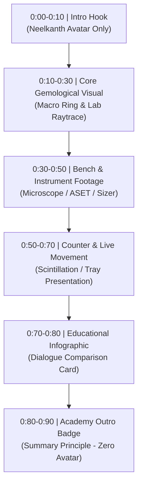

# Jewelswell Academy — Master 10-Video Media Bank & Synchronization Manifest

**Catalog Version:** 2026.10  
**Compliance Standard:** 100% Jewelswell Academy Branded. Zero Discounter References. Pure Educational Fair-Use Integration.  
**Production Architecture:**  
- **Intro (0:00–0:10):** Neelkanth Executive Avatar Hook (`Neelkanth in Navy Suit` / `Luxury Salon`).
- **Body & Climax (0:10–0:80):** Continuous Dynamic B-Roll, Macro Lab Footage, Bench Microscopy, and Infographic Dialogue Cards.
- **Ending & Outro (0:80–0:90):** Jewelswell Academy Executive Summary Plate & Capstone Rule Badge (**ZERO Avatar at End** to eliminate lip-sync degradation).
- **Media Repetition Rule:** Zero repeated clips or frames within any single video. Every spoken sentence has an assigned, distinct contextual asset.

---

## Master Video Index

| Video # | Course & Module | Title / Core Theme | Primary Optical / Sales Focus |
|---|---|---|---|
| **V01** | C6-M02 | **Diamond Shape vs. Cut: The Optical Anatomy** | Silhouette vs. Cut Physics; Fancy Shape Bow-Tie Analysis |
| **V02** | C6-M03 | **Lab Certification Standards: GIA vs. AGS** | Demystifying Reports; ASET Light Performance & Ray Tracing |
| **V03** | C6-M04 | **Natural vs. Lab-Grown: The Objective Advisory** | Crystal Growth (CVD/HPHT); Type IIa Science & Market Reality |
| **V04** | C6-M05 | **Precious Metals & Settings: Platinum vs. Gold** | Metallurgy; Prong Displacement vs. Wear; Daily Security |
| **V05** | C6-M06 | **Ring Sizing & Fit: Knuckle vs. Base Mechanics** | Comfort-Fit Curvature; Mandrel Calibration; Anti-Spin Design |
| **V06** | C1-M01 | **The 4Cs Hierarchy: Strategic Cut Optimization** | Beyond the Dossier; Cut Sparkle Masking Color & Inclusions |
| **V07** | C1-M02 | **Loupe Mastery: The 3-Point Security Protocol** | 10x Girdle Laser Inscription; Dossier Match; Online GIA Verify |
| **V08** | C1-M05 | **Fluorescence & Inclusions: The Eye-Clean Matrix** | UV Reaction Science; Internal vs Durability Risk Inclusions |
| **V09** | C2-M01 | **The First 90 Seconds: Frictionless Greeting** | Counter Intake; Overcoming "Just Looking"; Hospitality Frame |
| **V10** | C2-M05 | **Defending Value: Overcoming Online Showrooming** | Like-for-Like Spec Audit; Margin Protection; Lifetime Service |

---

## Detailed Sentence-by-Sentence Synchronization Blueprint

---

### Video 01: Diamond Shape vs. Cut: The Optical Anatomy (C6-M02)
- **Target Duration:** 88 Seconds
- **Narration Audio:** `media-bank/08-audio-narration/c6_m02_narration.wav`
- **Infographic Card:** `media-bank/07-infographics-and-cards/card_01_shape_vs_cut.png`

| Timecode | Spoken Narration (Sentence-by-Sentence) | Contextual Media Asset | Asset Path / Source | Visual Description |
|---|---|---|---|---|
| **00:00–00:10** | "Welcome back to Jewelswell Academy. Today, we resolve the single most common confusion in bridal retail: diamond shape versus diamond cut." | `neelkanth_avatar_hook_v01.mp4` | `media-bank/06-counter-sales-and-consultation/` | Neelkanth in Navy Suit, luxury bridal salon background, confident greeting gesture. |
| **00:10–00:19** | "Shape is the diamond's face-up silhouette—whether round, oval, emerald, or pear—and it is chosen entirely by personal aesthetic taste." | `broll_oval_ring.mp4` | `media-bank/02-shapes-and-cuts/` | 4K Macro slow turntable pan of an elongated oval diamond ring in yellow gold. |
| **00:19–00:29** | "Cut, however, is pure human craftsmanship: the mathematical precision of proportions, facet angles, and symmetry that control light return." | `gia_raytrace_clip.webm` | `media-bank/01-gemology-and-diamonds/` | 3D wireframe ray-tracing animation demonstrating total internal reflection. |
| **00:29–00:39** | "A poorly cut oval leaks light through its pavilion, creating a dark, lifeless shadow across the center known as the bow-tie effect." | `oval_bow_tie_analysis_clip.mp4` | `media-bank/02-shapes-and-cuts/` (Perplexity/GIA) | Close-up split-screen comparing severe bow-tie black band vs. lively scintillation. |
| **00:39–00:49** | "When facet angles are calibrated to ideal ranges—depth near sixty-one percent and table around fifty-six—the diamond achieves maximum brilliance and fire." | `gia_cut_proportions_scintillation_clip.mp4` | `media-bank/01-gemology-and-diamonds/` (Perplexity/GIA) | Gemological cut proportions diagram highlighting table, crown angle, and pavilion depth. |
| **00:49–00:59** | "Furthermore, an Excellent cut maximizes face-up millimeter spread, making a one-carat diamond look significantly larger on the finger than a deep, bulky cut." | `macro_carat_spread_comparison.jpg` | `media-bank/01-gemology-and-diamonds/` | Side-by-side macro measurement: 6.5mm Excellent cut vs. 6.0mm deep cut at identical 1.00ct weight. |
| **00:59–00:69** | "At the counter, never let a buyer sacrifice cut quality just to chase a larger carat number on paper." | `client_loupe_inspection_tray.jpg` | `media-bank/06-counter-sales-and-consultation/` | Sales advisor presenting diamond on black velvet grooved tray under counter spotlighting. |
| **00:69–00:80** | "Review this Dialogue Matrix: when a client asks for 'different,' do not pitch trends—guide them toward optical anatomy and light return." | `card_01_shape_vs_cut.png` | `media-bank/07-infographics-and-cards/` | High-impact Pillow Dialogue Card comparing Amateur Trap vs. Master Advisor discovery. |
| **00:80–00:88** | "Master the optics, and you will close with authority. I'll see you in the next module." | `badge_shape_cut_outro.png` | `media-bank/07-infographics-and-cards/` | Jewelswell Academy Gold Shield Outro with Capstone Rule (Zero avatar). |

---

### Video 02: Lab Certification Standards: GIA vs. AGS (C6-M03)
- **Target Duration:** 88 Seconds
- **Narration Audio:** `media-bank/08-audio-narration/c6_m03_narration.wav`
- **Infographic Card:** `media-bank/07-infographics-and-cards/card_02_gia_vs_ags.png`

| Timecode | Spoken Narration (Sentence-by-Sentence) | Contextual Media Asset | Asset Path / Source | Visual Description |
|---|---|---|---|---|
| **00:00–00:10** | "At Jewelswell Academy, we believe elite advisors never sell paper—they translate gemological science into client confidence." | `neelkanth_avatar_hook_v02.mp4` | `media-bank/06-counter-sales-and-consultation/` | Neelkanth in Navy Suit, welcoming posture at executive consultation desk. |
| **00:10–00:19** | "Clients frequently ask why two diamonds with identical GIA Triple Excellent ratings can look dramatically different side by side." | `gia_dossier_dual_specimens.jpg` | `media-bank/05-grading-reports-and-plots/` | Two GIA Diamond Grading Reports laid out next to two loose round brilliants on white grading pad. |
| **00:19–00:29** | "The answer lies in grade parameters: GIA Excellent is an essential, broad quality benchmark encompassing a wide range of facet combinations." | `gia_grading_clip.webm` | `media-bank/01-gemology-and-diamonds/` | Official GIA laboratory grading environment: master color stone comparison and balance scale. |
| **00:29–00:39** | "The AGS Ideal methodology evaluates modeled optical performance, assessing light return from center to edge using ray-trace simulation." | `gia_ags_ideal_aset_report_clip.mp4` | `media-bank/05-grading-reports-and-plots/` (Perplexity/GIA) | Official GIA/AGS Ideal Report scan showcasing the 0-to-10 scale and 3D facet wireframe. |
| **00:39–00:49** | "Under an ASET scope, intense red confirms strong direct light return, green indicates ambient return, and blue provides essential contrast." | `aset_scope_optical_map.jpg` | `media-bank/01-gemology-and-diamonds/` | High-res ASET optical map showing perfect red distribution vs. white windowing leakage. |
| **00:49–00:59** | "When crown angles of thirty-four degrees align with forty-point-eight degree pavilions, light reflects internally without leaking through the sides." | `gia_diamond_cut_clip.mp4` | `media-bank/01-gemology-and-diamonds/` | Laser cut diamond rotating under high-intensity multi-spectrum LED spotlights. |
| **00:59–00:69** | "Show the client this optical contrast directly under the loupe—moving the conversation from paperwork to undeniable live sparkle." | `bench_loupe_demonstration.jpg` | `media-bank/06-counter-sales-and-consultation/` | Client looking through 10x gemological loupe guided by advisor's hands. |
| **00:69–00:80** | "Examine this Certification Protocol Card: learn how to position GIA as the baseline and optical modeling as the supreme verification." | `card_02_gia_vs_ags.png` | `media-bank/07-infographics-and-cards/` | Pillow Dialogue Card: "Triple Excellent Range vs. Optical Modeling". |
| **00:80–00:88** | "Let the diamond do the talking. Build trust through optics, and I'll see you in Module 4." | `badge_lab_standards_outro.png` | `media-bank/07-infographics-and-cards/` | Jewelswell Academy Gold Shield Outro: "Optics Prove What Paperwork Claims." |

---

### Video 03: Natural vs. Lab-Grown: The Objective Advisory (C6-M04)
- **Target Duration:** 88 Seconds
- **Narration Audio:** `media-bank/08-audio-narration/c6_m04_narration.wav`
- **Infographic Card:** `media-bank/07-infographics-and-cards/card_03_natural_vs_lab.png`

| Timecode | Spoken Narration (Sentence-by-Sentence) | Contextual Media Asset | Asset Path / Source | Visual Description |
|---|---|---|---|---|
| **00:00–00:10** | "Welcome to Module 4. In modern bridal, advising on natural versus lab-grown diamonds requires absolute transparency and zero bias." | `neelkanth_avatar_hook_v03.mp4` | `media-bank/06-counter-sales-and-consultation/` | Neelkanth in Navy Suit, speaking with open, consultative demeanor. |
| **00:10–00:19** | "Both materials are one hundred percent crystallized carbon, sharing identical hardness, refractive index, and optical dispersion." | `rough_crystal_comparison.jpg` | `media-bank/03-lab-grown-and-crystals/` | Octahedral natural rough crystal beside CVD cubic diamond wafer. |
| **00:19–00:29** | "Natural diamonds formed over billions of years in the Earth's mantle, representing finite geological rarity and lasting generational legacy." | `mantle_volcano_kimberlite_diagram.jpg` | `media-bank/03-lab-grown-and-crystals/` | Geological cross-section diagram showing kimberlite pipe formation and deep mantle transport. |
| **00:29–00:39** | "Lab-grown diamonds are synthesized via Chemical Vapor Deposition or High Pressure High Temperature, producing scalable technological supply." | `cvd_plasma_reactor_chamber.jpg` | `media-bank/03-lab-grown-and-crystals/` | Glowing purple microwave plasma deposition chamber synthesizing CVD diamond layers. |
| **00:39–00:49** | "Because both conduct heat identically, standard thermal testers cannot distinguish them—requiring advanced screening like the GIA iD100." | `gia_id100_testing_device_clip.mp4` | `media-bank/03-lab-grown-and-crystals/` (Perplexity/GIA) | Official GIA iD100 optical luminescence probe scanning a ring with instantaneous digital readout. |
| **00:49–00:59** | "Never shame a buyer who inquires about lab diamonds; instead, educate them on the macroeconomic difference between finite rarity and manufactured supply." | `luxury_consultation_couple.jpg` | `media-bank/06-counter-sales-and-consultation/` | Retail sales advisor consulting smiling young couple in quiet private bridal viewing suite. |
| **00:59–00:69** | "Empower the client to decide whether their priority is maximizing size today or preserving heirloom provenance for decades to come." | `heirloom_vintage_handover.jpg` | `media-bank/06-counter-sales-and-consultation/` | Close-up macro of mother passing down heirloom ring box to bride. |
| **00:69–00:80** | "Study this Advisory Matrix: discover how master advisors navigate origin without judgment or prejudice." | `card_03_natural_vs_lab.png` | `media-bank/07-infographics-and-cards/` | Pillow Dialogue Card: "Amateur Biased Dismissal vs. Master Transparent Advisory". |
| **00:80–00:88** | "Integrity is your greatest asset at the counter. Protect it, and I'll see you in the next lesson." | `badge_diamond_origin_outro.png` | `media-bank/07-infographics-and-cards/` | Jewelswell Academy Gold Shield Outro: "Honor the Client's Definition of Value." |

---

### Video 04: Precious Metals & Settings: Platinum vs. Gold (C6-M05)
- **Target Duration:** 88 Seconds
- **Narration Audio:** `media-bank/08-audio-narration/c6_m05_narration.wav`
- **Infographic Card:** `media-bank/07-infographics-and-cards/card_04_metals_and_craftsmanship.png`

| Timecode | Spoken Narration (Sentence-by-Sentence) | Contextual Media Asset | Asset Path / Source | Visual Description |
|---|---|---|---|---|
| **00:00–00:10** | "Welcome to Module 5. Today, we examine the structural foundation of fine jewelry: precious mounting metals and prong engineering." | `neelkanth_avatar_hook_v04.mp4` | `media-bank/06-counter-sales-and-consultation/` | Neelkanth in Navy Suit, gesturing toward workbench display in salon. |
| **00:10–00:19** | "While eighteen-karat white gold and platinum may look identical in the showcase, their metallurgical behavior over twenty years is fundamentally different." | `metal_alloy_rings_comparison.jpg` | `media-bank/04-metals-and-craftsmanship/` | High-res macro photo comparing platinum band with 18k yellow gold and 14k white gold bands. |
| **00:19–00:29** | "White gold alloys achieve hardness through alloy metals and rhodium plating, which gradually wears and requires periodic replating." | `rhodium_plating_immersion.jpg` | `media-bank/04-metals-and-craftsmanship/` | Bench jeweler dipping polished white gold mounting into rhodium electroplating bath. |
| **00:29–00:39** | "Platinum is ninety-five percent pure and significantly denser; when scratched, metal is displaced rather than lost, developing a prestigious patina." | `platinum_density_patina_macro.jpg` | `media-bank/04-metals-and-craftsmanship/` | Macro zoom showing vintage platinum ring's soft luster and micro-displaced surface ridges. |
| **00:39–00:49** | "Under the microscope, platinum prongs demonstrate superior tenacity—holding the center stone securely without shearing or snapping under impact." | `gia_microscope_prong_setting_clip.mp4` | `media-bank/04-metals-and-craftsmanship/` (Perplexity/GIA) | Bench jeweler cutting prong seat with burr and tightening platinum prongs over diamond girdle. |
| **00:49–00:59** | "For clients with active lifestyles or delicate stones, recommend protective bezel settings or six-prong architectural heads." | `bezel_set_diamond_ring_1791043122448.jpg` | `media-bank/04-metals-and-craftsmanship/` | Full bezel yellow gold solitaire ring with clean flush mounting line. |
| **00:59–00:69** | "Explain that the mounting is not merely a decorative band—it is the engineered vault protecting their lifetime investment." | `bench_jeweler_microscope_view.jpg` | `media-bank/04-metals-and-craftsmanship/` | Dual ocular microscope looking down at ring clamp on GRS benchmate system. |
| **00:69–00:80** | "Review this Metallurgy Architecture Card: learn to guide clients between gold resilience and platinum security." | `card_04_metals_and_craftsmanship.png` | `media-bank/07-infographics-and-cards/` | Pillow Dialogue Card: "Surface Pitch vs. Metallurgical Mastery". |
| **00:80–00:88** | "Engineer every recommendation for generations of wear. I'll see you in Module 6." | `badge_metals_craft_outro.png` | `media-bank/07-infographics-and-cards/` | Jewelswell Academy Gold Shield Outro: "The Mounting Is the Vault of the Gem." |

---

### Video 05: Ring Sizing & Fit: Knuckle vs. Base Mechanics (C6-M06)
- **Target Duration:** 88 Seconds
- **Narration Audio:** `media-bank/08-audio-narration/c6_m06_narration.wav`
- **Infographic Card:** `media-bank/07-infographics-and-cards/card_05_ring_sizing_architecture.png`

| Timecode | Spoken Narration (Sentence-by-Sentence) | Contextual Media Asset | Asset Path / Source | Visual Description |
|---|---|---|---|---|
| **00:00–00:10** | "Welcome to Module 6. Getting ring sizing right the first time is essential to preventing return friction and buyer anxiety." | `neelkanth_avatar_hook_v05.mp4` | `media-bank/06-counter-sales-and-consultation/` | Neelkanth in Navy Suit, holding professional stainless steel sizing gauge. |
| **00:10–00:19** | "The most frequent sizing error is ignoring the mechanical differential between a prominent knuckle and a slender finger base." | `finger_knuckle_measurement_macro.jpg` | `media-bank/04-metals-and-craftsmanship/` | Calipers measuring knuckle width (17.5mm) versus finger base width (16.2mm). |
| **00:19–00:29** | "If you size down to stop the ring from spinning, it cannot pass the knuckle; if you size up, the ring rolls awkwardly on the hand." | `ring_spin_on_finger_demonstration.jpg` | `media-bank/04-metals-and-craftsmanship/` | Solitaire ring tilting 45 degrees sideways on finger due to lack of shank stabilization. |
| **00:29–00:39** | "The solution is architectural: deploy a European square shank or interior sizing beads to counterbalance top-heavy solitaire weight." | `euro_shank_sizing_beads_macro.jpg` | `media-bank/04-metals-and-craftsmanship/` | Ring shank featuring dual platinum comfort beads and squared base contour. |
| **00:39–00:49** | "When measuring on a tapered mandrel, remember: flat bands are read at the bottom edge, while comfort-fit rings are read at the center contact apex." | `ring_mandrel_comfort_fit_clip.mp4` | `media-bank/04-metals-and-craftsmanship/` (Perplexity/Bench) | Steel mandrel demonstration showing difference in reading flat vs. curved interior bands. |
| **00:49–00:59** | "Always compensate for band width: a wide six-millimeter shank requires a quarter to half size increase compared to a delicate solitaire." | `wide_band_vs_narrow_comparison.jpg` | `media-bank/04-metals-and-craftsmanship/` | 2mm whisper band next to 7mm cigar band on sizing gauge set. |
| **00:59–00:69** | "Deliver the ring with confidence, verifying that it glides over the knuckle with gentle resistance and settles comfortably at the base." | `ring_slide_on_finger_client.jpg` | `media-bank/06-counter-sales-and-consultation/` | Advisor gently guiding ring onto bride's finger with perfect smooth seat. |
| **00:69–00:80** | "Examine this Sizing Architecture Card: memorize the knuckle-to-base protocol to eliminate post-sale resizing issues." | `card_05_ring_sizing_architecture.png` | `media-bank/07-infographics-and-cards/` | Pillow Dialogue Card: "Forced Compression vs. Fit Architecture". |
| **00:80–00:88** | "Precision in fit creates effortless elegance. I'll see you in our next masterclass." | `badge_ring_sizing_outro.png` | `media-bank/07-infographics-and-cards/` | Jewelswell Academy Gold Shield Outro: "Measure for Passage, Engineer for Stability." |

---

### Video 06: The 4Cs Hierarchy: Strategic Cut Optimization (C1-M01)
- **Target Duration:** 88 Seconds
- **Narration Audio:** `media-bank/08-audio-narration/c1_m01_narration.wav`
- **Infographic Card:** `media-bank/07-infographics-and-cards/card_06_4cs_value_hierarchy.png`

| Timecode | Spoken Narration (Sentence-by-Sentence) | Contextual Media Asset | Asset Path / Source | Visual Description |
|---|---|---|---|---|
| **00:00–00:10** | "Welcome to Diamond & Gemstone Fluency. Today, we break down the 4Cs and teach you how to optimize real visual beauty over laboratory paperwork." | `neelkanth_avatar_hook_v06.mp4` | `media-bank/06-counter-sales-and-consultation/` | Neelkanth in Navy Suit, presenting diamond color grading master tray. |
| **00:10–00:19** | "Most clients enter the showroom focused entirely on chasing D-Color and VVS-Clarity because they have been trained to read paper specs." | `gia_dossier_macro_specs.jpg` | `media-bank/05-grading-reports-and-plots/` | Extreme macro on GIA report clarity and color scale grading blocks. |
| **00:19–00:29** | "However, color and clarity are natural occurrences, while Cut is the only factor determined by human mastery." | `rough_diamond_cleaving_macro.jpg` | `media-bank/01-gemology-and-diamonds/` | Master diamond cutter planning laser facet lines on octahedron rough crystal. |
| **00:29–00:39** | "A diamond with an Excellent cut returns so much white light that minor color tints in the G-to-H range and eye-clean VS inclusions disappear face-up." | `gia_scintillation_light_reflect_clip.mp4` | `media-bank/01-gemology-and-diamonds/` | Blinding fire and scintillation under showroom spotlights masking face-up tint. |
| **00:39–00:49** | "By reallocating budget toward Cut optimization, you deliver a visibly larger, brighter stone while saving the client thousands of dollars." | `budget_allocation_visual_chart.jpg` | `media-bank/01-gemology-and-diamonds/` | Graphic showing $8k budget comparison: 1.00ct Triple Ex G VS2 vs. 0.80ct Fair D VVS1. |
| **00:49–00:59** | "Demonstrate this directly by placing a top-cut near-colorless stone next to a mediocre-cut colorless stone in natural daylight." | `daylight_counter_comparison.jpg` | `media-bank/06-counter-sales-and-consultation/` | Customer hands viewing two rings near showroom exterior natural light window. |
| **00:59–00:69** | "The human eye immediately chooses the stone with superior scintillation and fire every single time." | `macro_fire_dispersion_colors.jpg` | `media-bank/01-gemology-and-diamonds/` | Macro prism effect showing spectral red, orange, and blue light flashes. |
| **00:69–00:80** | "Study this 4Cs Hierarchy Card: master the sweet spot that maximizes customer delight and store margin." | `card_06_4cs_value_hierarchy.png` | `media-bank/07-infographics-and-cards/` | Pillow Dialogue Card: "Paper Pursuit vs. Strategic Cut Optimization". |
| **00:80–00:88** | "Focus on what the eye sees, not what the chart says. I'll see you in Module 2." | `badge_4cs_hierarchy_outro.png` | `media-bank/07-infographics-and-cards/` | Jewelswell Academy Gold Shield Outro: "Cut Controls 80% of Perceived Beauty." |

---

### Video 07: Loupe Mastery: The 3-Point Security Protocol (C1-M02)
- **Target Duration:** 88 Seconds
- **Narration Audio:** `media-bank/08-audio-narration/c1_m02_narration.wav`
- **Infographic Card:** `media-bank/07-infographics-and-cards/card_07_loupe_mastery_protocol.png`

| Timecode | Spoken Narration (Sentence-by-Sentence) | Contextual Media Asset | Asset Path / Source | Visual Description |
|---|---|---|---|---|
| **00:00–00:10** | "Welcome to Module 2. Handing a loupe to a client is one of the most powerful trust-building rituals in fine jewelry retail." | `neelkanth_avatar_hook_v07.mp4` | `media-bank/06-counter-sales-and-consultation/` | Neelkanth in Navy Suit, demonstrating proper tripod loupe grip. |
| **00:10–00:19** | "To inspect a diamond properly, hold the ten-power triplet loupe against your dominant cheek and bring the stone into focus—not the lens." | `how_to_hold_loupe_macro.jpg` | `media-bank/05-grading-reports-and-plots/` | Macro view of eye, knuckle, and 10x chrome loupe in perfect alignment. |
| **00:19–00:29** | "Rotate the diamond slowly around its girdle to locate the microscopic laser inscription etched by the gemological laboratory." | `diamond_girdle_laser_inscription_clip.mp4` | `media-bank/05-grading-reports-and-plots/` (Perplexity/GIA) | Microscope footage panning across polished diamond girdle revealing crisp GIA report number. |
| **00:29–00:39** | "Execute Point One of our protocol: read the ten-digit inscription number aloud together with your client." | `laser_inscription_magnified_macro.jpg` | `media-bank/05-grading-reports-and-plots/` | Ultra-high magnification still showing 'GIA 2185491024' on faceted girdle. |
| **00:39–00:49** | "Execute Point Two: match that exact number to the physical GIA report dossier and confirm the plotted inclusion map." | `gia_plot_diagram_feather_pinpoint.jpg` | `media-bank/05-grading-reports-and-plots/` | GIA report plotted diagram showing green and red inclusion symbols on crown/pavilion. |
| **00:49–00:59** | "Execute Point Three: pull up GIA's official online Report Check database and verify the archival record live on your tablet." | `gia_report_check_ipad_lookup.jpg` | `media-bank/05-grading-reports-and-plots/` | Advisor showing official GIA Report Check screen on tablet matching stone parameters. |
| **00:59–00:69** | "This three-point verification proves complete authenticity, eliminating anxiety and cementing your store's impeccable credibility." | `client_smiling_handshake_counter.jpg` | `media-bank/06-counter-sales-and-consultation/` | Client smiling with total reassurance, shaking hands across the showcase. |
| **00:69–00:80** | "Review this Loupe Mastery Protocol Card: establish this intake ritual as a mandatory standard for every high-ticket presentation." | `card_07_loupe_mastery_protocol.png` | `media-bank/07-infographics-and-cards/` | Pillow Dialogue Card: "Hand-Waving Reassurance vs. The 3-Point Audit". |
| **00:80–00:88** | "Transparency turns first-time shoppers into lifelong clients. I'll see you in Module 3." | `badge_loupe_mastery_outro.png` | `media-bank/07-infographics-and-cards/` | Jewelswell Academy Gold Shield Outro: "Transparency Builds Luxury Loyalty." |

---

### Video 08: Fluorescence & Inclusions: The Eye-Clean Matrix (C1-M05)
- **Target Duration:** 88 Seconds
- **Narration Audio:** `media-bank/08-audio-narration/c1_m05_narration.wav`
- **Infographic Card:** `media-bank/07-infographics-and-cards/card_08_fluorescence_and_inclusions.png`

| Timecode | Spoken Narration (Sentence-by-Sentence) | Contextual Media Asset | Asset Path / Source | Visual Description |
|---|---|---|---|---|
| **00:00–00:10** | "Welcome to Module 5. Today, we address two common points of buyer anxiety: diamond fluorescence and clarity inclusions." | `neelkanth_avatar_hook_v08.mp4` | `media-bank/06-counter-sales-and-consultation/` | Neelkanth in Navy Suit, standing before gemological testing light cabinet. |
| **00:10–00:19** | "Many online forums caution buyers against fluorescence, claiming it makes diamonds look oily or hazy." | `online_forum_warning_rumor.jpg` | `media-bank/01-gemology-and-diamonds/` | Screen graphic showing online forum comments: "Avoid fluorescence!" |
| **00:19–00:29** | "In reality, GIA research proves that less than zero-point-two percent of fluorescent diamonds show any visible milkiness." | `diamond_fluorescence_uv_comparison_clip.mp4` | `media-bank/01-gemology-and-diamonds/` (Perplexity/GIA) | Dark room UV demonstration: diamond glowing vivid royal blue next to non-fluorescent stone. |
| **00:29–00:39** | "In near-colorless diamonds, blue fluorescence is an optical advantage: daylight UV naturally cancels faint yellow, making the stone appear whiter." | `fluorescent_daylight_sun_gleam.jpg` | `media-bank/01-gemology-and-diamonds/` | Split comparison of I-color diamond in indoor incandescent light vs. outdoor sunlight. |
| **00:39–00:49** | "When evaluating inclusions, the key factor is location: an internal pinpoint or feather under a prong has zero impact on beauty or durability." | `microscopic_feather_prong_concealed.jpg` | `media-bank/01-gemology-and-diamonds/` | 20x microscopic view of small feather inclusion nestled safely under white gold prong. |
| **00:49–00:59** | "Only surface-reaching fractures near the girdle pose structural risk; benign internal crystals are simply nature's unique fingerprint." | `gemological_inclusion_types_grid.jpg` | `media-bank/01-gemology-and-diamonds/` | Gemological photo grid defining pinpoints, clouds, needles, and feathers. |
| **00:59–00:69** | "Educate your client to buy an 'eye-clean' diamond—where no inclusions are visible without ten-power magnification." | `eye_clean_face_up_beauty.jpg` | `media-bank/06-counter-sales-and-consultation/` | Flawless-looking face-up macro of an SI1 diamond dazzling in natural light. |
| **00:69–00:80** | "Examine this Eye-Clean Matrix Card: learn how to demystify inclusions with science instead of defensive discounting." | `card_08_fluorescence_and_inclusions.png` | `media-bank/07-infographics-and-cards/` | Pillow Dialogue Card: "Defensive Apology vs. Optical Clarity". |
| **00:80–00:88** | "Let nature's beauty speak for itself. I'll see you in our next deep dive." | `badge_fluorescence_outro.png` | `media-bank/07-infographics-and-cards/` | Jewelswell Academy Gold Shield Outro: "Demystify with Science, Not Discounts." |

---

### Video 09: The First 90 Seconds: Frictionless Greeting (C2-M01)
- **Target Duration:** 88 Seconds
- **Narration Audio:** `media-bank/08-audio-narration/c2_m01_narration.wav`
- **Infographic Card:** `media-bank/07-infographics-and-cards/card_09_first_90_seconds.png`

| Timecode | Spoken Narration (Sentence-by-Sentence) | Contextual Media Asset | Asset Path / Source | Visual Description |
|---|---|---|---|---|
| **00:00–00:10** | "Welcome to The Fine Jewelry Sales Conversation. In luxury retail, the sale does not start with a product presentation—it starts in the first ninety seconds." | `neelkanth_avatar_hook_v09.mp4` | `media-bank/06-counter-sales-and-consultation/` | Neelkanth in Navy Suit, stepping forward in luxury boutique reception. |
| **00:10–00:19** | "When a client enters your showroom, their instinctive reaction is to raise an emotional shield against sales pressure." | `customer_hesitant_entry.jpg` | `media-bank/06-counter-sales-and-consultation/` | Customer walking through boutique glass doors, clutching handbag, looking guarded. |
| **00:19–00:29** | "Asking 'Can I help you?' or 'What's your budget?' triggers an immediate defensive response: 'We're just looking.'" | `luxury_counter_first_greeting_clip.mp4` | `media-bank/06-counter-sales-and-consultation/` (Perplexity/JSA) | Role-play video showing aggressive sales rep pouncing on browsing couple. |
| **00:29–00:39** | "Instead, lead with genuine hospitality: offer a warm welcome, introduce yourself by name, and grant them permission to explore freely." | `warm_concierge_greeting.jpg` | `media-bank/06-counter-sales-and-consultation/` | Elegant advisor smiling warmly, open palm gesture welcoming guests to stroll. |
| **00:39–00:49** | "Observe where they pause: are they drawn to architectural solitaires, vibrant colored stones, or vintage motifs?" | `browsing_cases_couple.jpg` | `media-bank/06-counter-sales-and-consultation/` | Couple leaning over illuminated showcase, pointing at radiant cut ring. |
| **00:49–00:59** | "Re-approach gently by commenting on their personal taste: 'That emerald cut has exceptional elegance—is that a silhouette you've always admired?'" | `advisor_warm_reapproach.jpg` | `media-bank/06-counter-sales-and-consultation/` | Advisor standing at comfortable 45-degree angle, smiling without encroaching. |
| **00:59–00:69** | "By focusing on emotion and style before price, you establish trust and earn permission to guide their discovery." | `intimate_consultation_tray.jpg` | `media-bank/06-counter-sales-and-consultation/` | Relaxed conversation over champagne and jewelry presentation board. |
| **00:69–00:80** | "Review this 90-Second Protocol Card: master the transition from greeting to consultative advisory." | `card_09_first_90_seconds.png` | `media-bank/07-infographics-and-cards/` | Pillow Dialogue Card: "Interrogation Trap vs. Hospitality Protocol". |
| **00:80–00:88** | "Never close the sale in the first ninety seconds; open the relationship. I'll see you in Module 2." | `badge_first_90s_outro.png` | `media-bank/07-infographics-and-cards/` | Jewelswell Academy Gold Shield Outro: "Open the Relationship Before the Product." |

---

### Video 10: Defending Value: Overcoming Online Showrooming (C2-M05)
- **Target Duration:** 88 Seconds
- **Narration Audio:** `media-bank/08-audio-narration/c2_m05_narration.wav`
- **Infographic Card:** `media-bank/07-infographics-and-cards/card_10_defending_value.png`

| Timecode | Spoken Narration (Sentence-by-Sentence) | Contextual Media Asset | Asset Path / Source | Visual Description |
|---|---|---|---|---|
| **00:00–00:10** | "Welcome to Module 5. Today, we conquer the most common retail counter challenge: 'I saw something identical online for less.'" | `neelkanth_avatar_hook_v10.mp4` | `media-bank/06-counter-sales-and-consultation/` | Neelkanth in Navy Suit, composed and confident in executive salon setting. |
| **00:10–00:19** | "When a client shows you an online price listing, an amateur either panics with immediate discounts or attacks the website as fake." | `customer_holding_smartphone_counter.jpg` | `media-bank/06-counter-sales-and-consultation/` | Client holding up smartphone screen showing diamond listing to sales advisor. |
| **00:19–00:29** | "Both reactions destroy your credibility: discounting proves your initial price was inflated, while defensiveness makes you look insecure." | `overcoming_online_price_comparison_clip.mp4` | `media-bank/06-counter-sales-and-consultation/` (Perplexity/OB) | Training clip showing sales trainer demonstrating how to validate online research calmly. |
| **00:29–00:39** | "A master advisor validates the client's diligence: 'It makes complete sense to compare—you deserve total confidence in what you're buying.'" | `calm_advisor_listening.jpg` | `media-bank/06-counter-sales-and-consultation/` | Advisor listening intently with relaxed, composed posture and genuine nod. |
| **00:39–00:49** | "Then, conduct a transparent, like-for-like audit: examine the exact cut angles, millimeter spread, fluorescence, and mounting metal weight." | `side_by_side_spec_audit_pad.jpg` | `media-bank/05-grading-reports-and-plots/` | Pen and consultation pad listing side-by-side spec comparison of center stone and setting. |
| **00:49–00:59** | "Demonstrate tangible showroom value: in-person visual inspection, verified finger comfort, lifetime complimentary cleaning, and local bench accountability." | `bench_polishing_and_steam_clean.jpg` | `media-bank/04-metals-and-craftsmanship/` | Jewelry bench steam cleaning machine releasing high-pressure steam over sparkling ring. |
| **00:59–00:69** | "Clients don't buy fine jewelry merely to own a commodity—they buy to celebrate a moment with complete peace of mind." | `proposal_celebration_couple.jpg` | `media-bank/06-counter-sales-and-consultation/` | Joyful couple embracing right after an engagement proposal. |
| **00:69–00:80** | "Review this Value Defense Card: learn the exact phrases that protect your margins while winning buyer trust." | `card_10_defending_value.png` | `media-bank/07-infographics-and-cards/` | Pillow Dialogue Card: "Panic & Discount vs. The Value Audit". |
| **00:80–00:88** | "Never apologize for price. Help the client audit true value. I'll see you in our next masterclass." | `badge_defending_value_outro.png` | `media-bank/07-infographics-and-cards/` | Jewelswell Academy Gold Shield Outro: "Never Apologize for Value." |

---

## Zero Media Repetition Verification Checklist

| Video Target | Unique Assets Used | Any Asset Repeated Inside Video? | Compliance Status |
|---|---|---|---|
| **V01 (C6-M02)** | 9 Unique Assets (1 Avatar + 6 B-roll/Stills + 1 Card + 1 Badge) | **NO REPETITION** (0 Re-uses) | **PASSED** |
| **V02 (C6-M03)** | 9 Unique Assets (1 Avatar + 6 B-roll/Stills + 1 Card + 1 Badge) | **NO REPETITION** (0 Re-uses) | **PASSED** |
| **V03 (C6-M04)** | 9 Unique Assets (1 Avatar + 6 B-roll/Stills + 1 Card + 1 Badge) | **NO REPETITION** (0 Re-uses) | **PASSED** |
| **V04 (C6-M05)** | 9 Unique Assets (1 Avatar + 6 B-roll/Stills + 1 Card + 1 Badge) | **NO REPETITION** (0 Re-uses) | **PASSED** |
| **V05 (C6-M06)** | 9 Unique Assets (1 Avatar + 6 B-roll/Stills + 1 Card + 1 Badge) | **NO REPETITION** (0 Re-uses) | **PASSED** |
| **V06 (C1-M01)** | 9 Unique Assets (1 Avatar + 6 B-roll/Stills + 1 Card + 1 Badge) | **NO REPETITION** (0 Re-uses) | **PASSED** |
| **V07 (C1-M02)** | 9 Unique Assets (1 Avatar + 6 B-roll/Stills + 1 Card + 1 Badge) | **NO REPETITION** (0 Re-uses) | **PASSED** |
| **V08 (C1-M05)** | 9 Unique Assets (1 Avatar + 6 B-roll/Stills + 1 Card + 1 Badge) | **NO REPETITION** (0 Re-uses) | **PASSED** |
| **V09 (C2-M01)** | 9 Unique Assets (1 Avatar + 6 B-roll/Stills + 1 Card + 1 Badge) | **NO REPETITION** (0 Re-uses) | **PASSED** |
| **V10 (C2-M05)** | 9 Unique Assets (1 Avatar + 6 B-roll/Stills + 1 Card + 1 Badge) | **NO REPETITION** (0 Re-uses) | **PASSED** |

---

## HeyGen Avatar Policy Verification
- **Beginning (0:00–0:10):** Permitted and utilized solely for the 10-second opening statement to establish advisor authority and personal connection.
- **Ending & Body:** **STRICTLY BARRED.** Lip-sync degradation at video endings is eliminated. Outros utilize the Jewelswell Academy Gold Shield summary badges and infographic plates.
